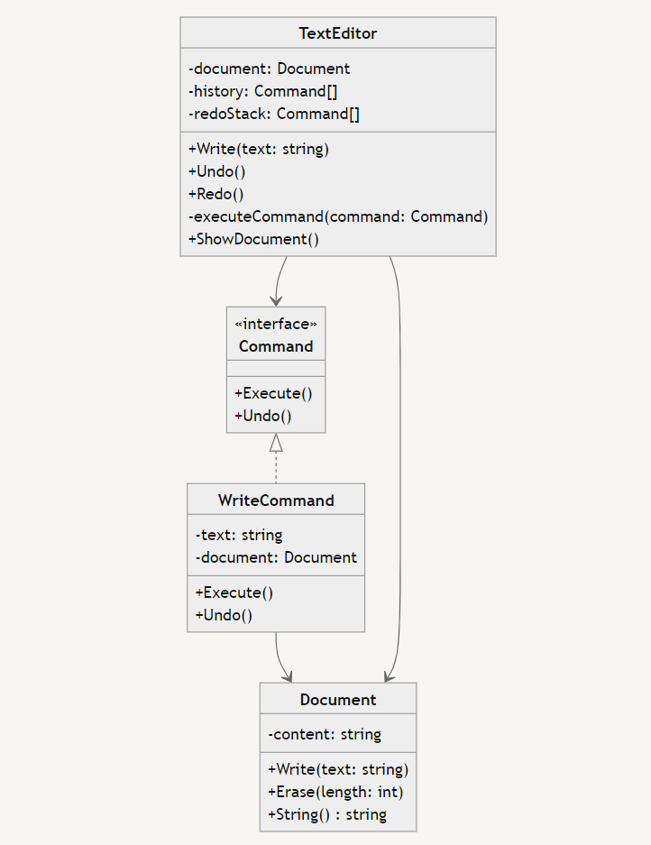

# Command Design Pattern 🎮

The Command Design Pattern is a behavioral design pattern that turns a request into a stand-alone object containing all information about the request. This transformation allows you to parameterize methods with different requests, delay or queue a request's execution, and support undoable operations. 🔄

## Key Components 🧩

- **Command:** An interface for executing an operation.
- **Concrete Command:** Implements the Command interface and defines the binding between a Receiver object and an action.
- **Invoker:** Asks the command to carry out the request.
- **Receiver:** Knows how to perform the operations associated with carrying out a request.
- **Client:** Creates a ConcreteCommand object and sets its receiver.

## When to Use Command Pattern 🤔

- When you need to parameterize objects with operations. 🔧
- When you want to queue operations, schedule their execution, or execute them remotely. 📅
- When you need to implement reversible operations (like undo/redo). ↩️
- When you want to structure a system around high-level operations built on primitive operations. (Abstraction) 🏗️
- When you need to decouple the object that invokes the operation from the object that performs it. 🔓

The Command pattern is particularly useful in scenarios where you need to maintain a history of actions, implement transactional behavior, or create complex systems with multiple levels of undo/redo functionality. It promotes loose coupling and enhances the flexibility and extensibility of your codebase. 🚀

## Example: Text Editor with Undo/Redo ✏️

Let's implement a simple text editor with undo and redo functionality using the Command pattern:



This UML diagram illustrates the relationships between the classes in the text editor example:

- The `Command` interface defines the contract for all commands with `Execute()` and `Undo()` methods.
- The `WriteCommand` implements the `Command` interface and has a reference to the `Document` it operates on.
- The `Document` class represents the text content and provides methods to manipulate it.
- The `TextEditor` class is the main controller, managing the document, command history, and redo stack. It uses the Command pattern to execute, undo, and redo operations.

```bash
go run *.go
Hello World!
Hello 
Hello World!
```
