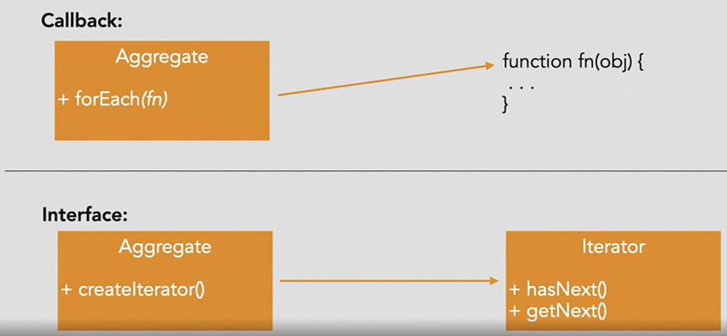

# Iterator
Iterator is used to traverse a container and access the container's elements without exposing the underlying storage system of the container.

## Purpose: 
- Describes a way of accessing the elements contained within an object without exposing the underlying implementation of the container

## Scenarios:
- Useful for objects that expose collections of elements
- for example, a Library object that keeps track of publications such as books, magazines, and DVDs



**The "Pull" Model Iterator**
With the pull-oriented interface, the consumer of the container data has control over when and how the data is accessed.


### Example of Book Iterator

In this example, we have `BookIterator` that implements the iterator interface and `Library` that implements the IterableCollection.

```python
go run *.go
Book title: War and Peace
Book title: Crime and Punishment
Book title: Brave New World
Book title: Catcher in the Rye
Book title: To Kill a Mockingbird
Book title: The Grapes of Wrath
Book title: Wuthering Heights
Book author: Leo Tolstoy
Book author: Leo Tolstoy
Book author: Aldous Huxley
Book author: J.D. Salinger
Book author: Harper Lee
Book author: John Steinbeck
Book author: Emily Bronte
Book &{Name:War and Peace Author:Leo Tolstoy PageCount:864 Type:0}
Book &{Name:Crime and Punishment Author:Leo Tolstoy PageCount:1225 Type:1}
Book &{Name:Brave New World Author:Aldous Huxley PageCount:325 Type:2}
Book &{Name:Catcher in the Rye Author:J.D. Salinger PageCount:206 Type:0}
Book &{Name:To Kill a Mockingbird Author:Harper Lee PageCount:399 Type:2}
Book &{Name:The Grapes of Wrath Author:John Steinbeck PageCount:464 Type:0}
Book &{Name:Wuthering Heights Author:Emily Bronte PageCount:288 Type:3}
```