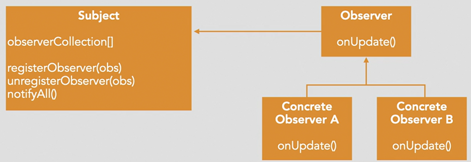
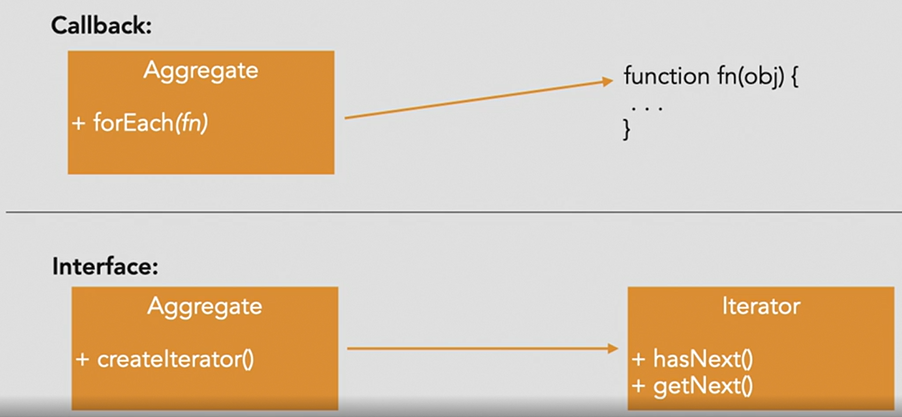
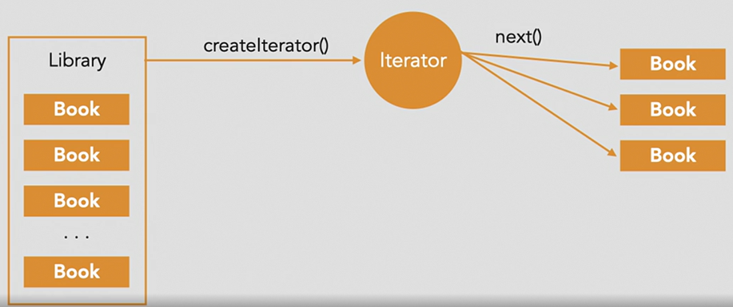

## Behavioral Patterns

## Observer
Observer defines a pattern where a given object maintains a list of dependent objects that are notified when the state of the main object changes.

Purpose:
- Provides the ability for a subject to notify a set of "observers" about changes to the subject
- Used to maintain loose coupling between elements of a system that interact with each other

Scenarios:
- Systems where state changes of a subject cannot be predicted and the list of interested "listeners" cannot be known in advance or changes during runtime

## Iterator
Iterator is used to traverse a container and access the container's elements without exposing the underlying storage system of the container.

Purpose: 
- Describes a way of accessing the elements contained within an object without exposing the underlying implementation of the container

Scenarios:
- Useful for objects that expose collections of elements
- for example, a Library object that keeps track of publications such as books, magazines, and DVDs

**The "Pull" Model Iterator**
With the pull-oriented interface, the consumer of the container data has control over when and how the data is accessed.

