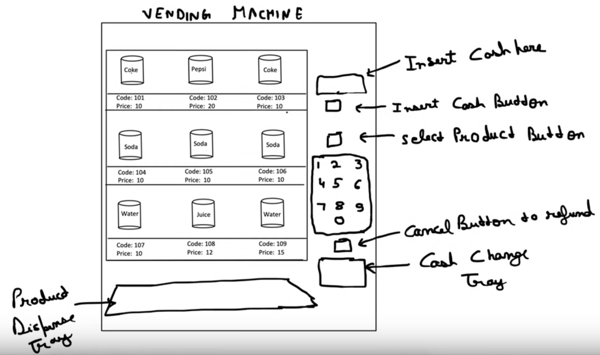
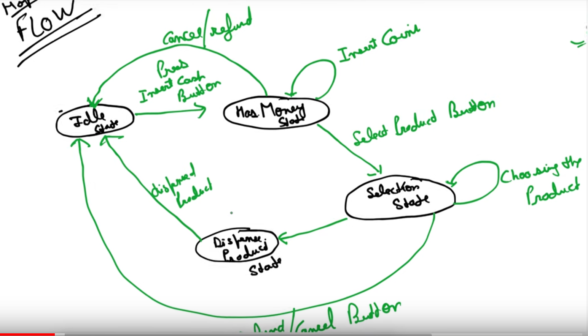

# Vending machine

Let's design a vending machien using the state design pattern.

## Componenets of a Vending machine



- Insert cash button
- Insert Cash slot
- Cancel button
- Product selection Buttons
- Cash Change Tray
- Product Dispense Tray
- Multiple Products (with Ids and prices)

We can have following states, if we do a combination of operations:
1. NoCashState
2. HasCashState
3. ProductSelectedState
4. DispensingState

Happy flow 



## Class Diagram


## Implementation Details

1. The VendingMachine struct will maintain the current state and delegate the actions to the current state object.

2. Each state implement the state interface and provide its own implementation for the actions. 

3. The states will transition as follows:
- NoCashState → HasCashState (when cash is inserted)
- HasCashState → ProductSelectedState (when a product is selected)
- ProductSelectedState → DispensingState (when the product is being dispensed)
- DispensingState → NoCashState (after dispensing and returning change)

4. The cancel button can be pressed at any state, which will return the machine to the NoCashState and return any inserted cash.

5. The Product class will hold information about each product, including its ID, name, and price.

## Output

```
go run *.go
Insert 10.00. Current balance: 10.00
Selected product: Chips 
Dispensing Chips

Insert 7.00. Current balance: 7.00
Selected product: Candy 
Dispensing Candy

Returning change: 2.00
Insert 5.00. Current balance: 5.00
Insufficient balance. Please insert 5.00 more 
Insert 5.00. Current balance: 10.00
Selected product: Chips 
Dispensing Chips

Insert 15.00. Current balance: 15.00
Selected product: Cola 
Cancelling transaction. Returning 15.00 
```

Reference for Figures:
[Concept && Coding](https://www.youtube.com/watch?v=wOXs5Z_z0Ew&list=PL6W8uoQQ2c61X_9e6Net0WdYZidm7zooW&index=19&pp=iAQB)