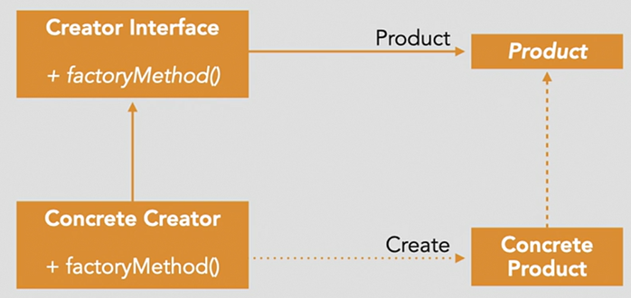

# Factory

create objects based on condition.

Purpose: 
- Allows for the construction of objects when the types of those objects is determined at runtime

Scenarios:
- Produces code that is more readable when there are multiple ways of creating a particular object
- Situations where object creation needs to flexible and cannot be known beforehand

How to do this:
- pass paramter of particular type in factory method

