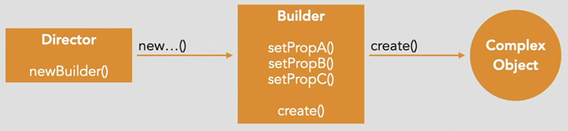
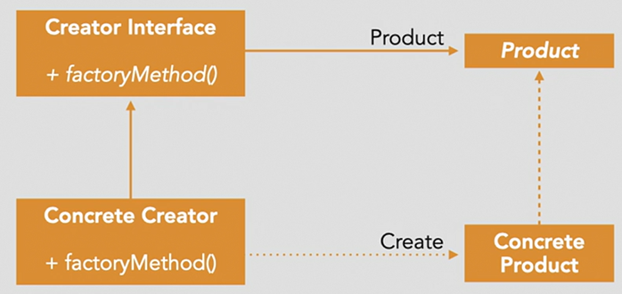
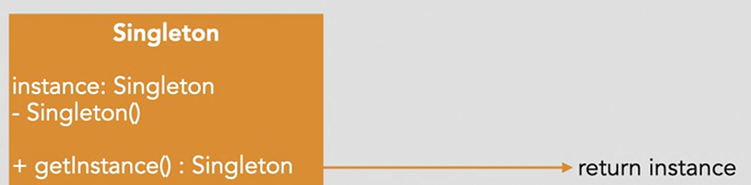

## Creational Pattern
Creational design patterns deal with object creation mechanisms, trying to create objects in a manner suitable to the situation.

The most common types of creational design patterns include Factory Method, Abstract Factory, Builder, Prototype, and Singleton.

## Builder
Purpose 
- *Encapsulates an object's construction process* along with specifying the various parts of a comlex API
- Enables flexible creation of an object that can have many different representations
- Increase code readability for complex types

Scenarios:

Objects that have complex APIs, multiple constructor options, and several different possible representations.

How to do this:
- Create a builder method, that returns a particular object

## Factory

Purpose: 
- Allows for the construction of objects when the types of those objects is not predetermined at runtime

Scenarios:
- Produces code that is more readable when there are multiple ways of creating a particular object
- Situations where object creation needs to flexible and cannot be known beforehand

How to do this:
- pass paramter of particular type in factory method

## Singleton

Purpose:
- The Singleton pattern restricts the instantiation of a class to a single instance and provides global access.
- Allows for lazy initialization of the class

Scenarios:
- Situations where you want to ensure there is only one instance of a class: logging, configuration, telemetry, debugging.

How to do this:

- By checking if global instance variable is nil
- For goroutines, you can use the sync.Once method to achieve Singleton.

