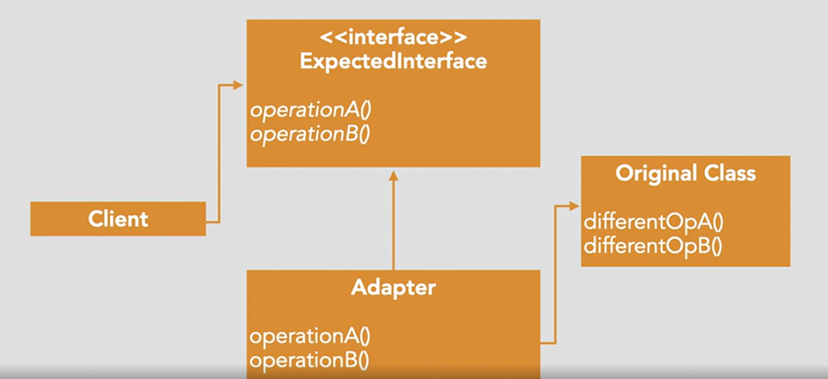

# Adapater
The Adapter pattern allows the interface of an existing class to be used as another interface without modifying the source code.

## Purpose: 
- Allows the interface of an existing subsystem or API to be used as another interface without modifying the code of the existing API

## Scenarios:
- Enables incompatible objects to work together without having to make changes to either one.

How to do: 
- create a new struct that uses old struct and its receiver methods.



### Example.go

- The `Target` interface defines the domain-specific interface that the client uses.
- The `Adaptee` is the existing interface that needs adapting.
- The `Adapter` implements the `Target` interface and wraps the `Adaptee`.
- The `main` function demonstrates how the client code can work with the `Adaptee` through the `Adapter`.

```
Adapater: (Translated) Adaptee's specific Request
```

This pattern is useful when you want to use an existing class, but its interface isn't compatible with the rest of your code.