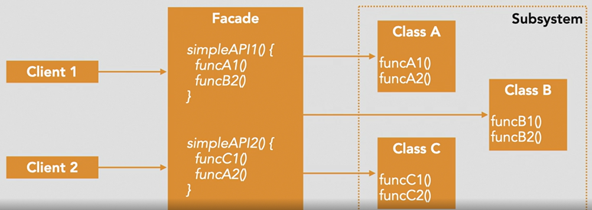

## Structural Design Patterns 🏗️

Structural design patterns are concerned with how classes and objects are composed to form larger structures. They help ensure that when parts of a system change, the entire structure doesn't need to change. 🧱

Some common structural design patterns include:

- **Adapter:** Allows incompatible interfaces to work together. 🔌
- **Bridge:** Separates an object's abstraction from its implementation. 🌉
- **Composite:** Composes objects into tree structures to represent part-whole hierarchies. 🌳
- **Decorator:** Adds new functionality to an object without altering its structure. 🎀
- **Facade:** Provides a simplified interface to a complex subsystem. 🏢
- **Flyweight:** Reduces the cost of creating and manipulating a large number of similar objects. 🪶
- **Proxy:** Provides a surrogate or placeholder for another object to control access to it. 🕵️

These patterns focus on relationships between entities, making the design more flexible, efficient, and easier to understand and maintain. 🔧💡

## Facade
The Facade pattern is mainly used to simplify the interface to a more complex object **or** to provide a context-specific interface to a more generic API.

Purpose:
- Provide a simple, front-facing interface to a more complex system, library, or API

Scenarios:
- Improve usability of a more complex API
- Serve as a starting point for refactoring
- Reduce tight coupling between parts of a system

How to use:
- Instead of directly interacting with the API, we use inbetween facade methods.

