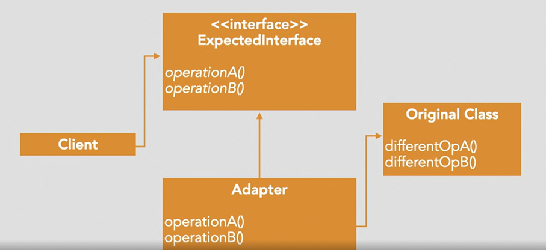

## Structural Pattern

## Adapater

Purpose: 
- Allows the interface of an existing subsystem or API to be used as another interface without modifying the code of the existing API

Scenarios:
- Enables incompatible objects to work together without having to make changes to either one.

How to do: 
- create a new struct that uses old struct and its receiver methods.

